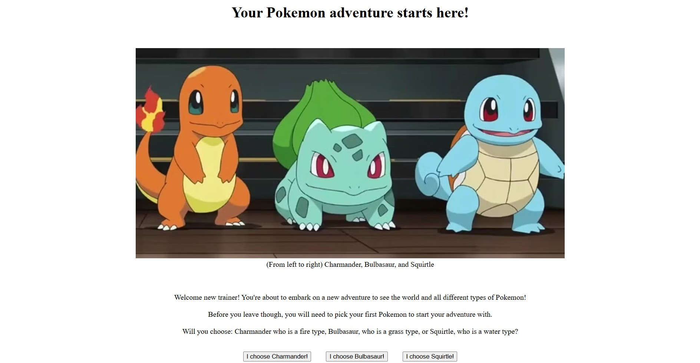

<h1>Choose Your Own Adventure!</h1>


<h2>Description</h2>
<p>Project consists of a simple three choices that the user will be able to choose from. I decided to create an adventure based off Pokémon where the user is a new trainer starting off their adventure with their very first Pokémon! What adventure will await you?</p>
<br />


<h2>Languages and Utilities Used</h2>

- <b>HTML</b>
- <b>CSS</b> 
- <b>JavaScript</b>
- <b>Visual Studio Code</b>

<h2>Environments Used </h2>

- <b>Windows 11</b>

<h2>Program at a glance:</h2>


<h3>The beginning of your adventure starts here!</h3> <br/>
<p>The following image shows the start of the Choose Your Own Adventure. The user is given the option to choose between three Pokémon: Charmander, Bulbasaur, or Squirtle.</p>

<br />

<p>P.S. to be continued with more options in the forseeable future</p>


<!--
 ```diff
- text in red
+ text in green
! text in orange
# text in gray
@@ text in purple (and bold)@@
```
--!>
